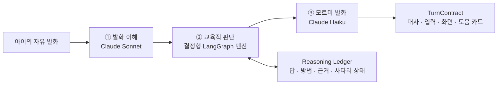

<div align="center">

# 🌱 Mormi AI

### 아이가 선생님이 되는 기초 수학 대화 엔진

경계선지능 아동이 AI 동생 **모르미**를 가르치며 기초 수학을 말로 설명하고
생활 속에서 다시 사용하도록 돕습니다.

[](https://github.com/flyai-y2s2/Mormi-AI/actions/workflows/deploy.yml)


[서비스 체험하기](https://iamssam.vercel.app) · [아키텍처](./docs/ARCHITECTURE.md) · [API 명세](./docs/API_SPEC.md)

</div>

---

## 왜 모르미인가요?

기존 학습은 아이에게 설명을 들려주고 정답을 평가합니다. 모르미는 역할을 뒤집습니다.
모르미가 먼저 도움을 요청하고, 아이가 자신이 아는 것을 설명하며, 모르미는 아이가 실제로
말해 준 만큼만 이해합니다. 아이는 도움받는 학습자에서 누군가를 가르친 선생님이 됩니다.

## 대화는 어떻게 만들어지나요?



| 단계 | 책임 |
|---|---|
| **발화 이해** | 다양한 아이 표현에서 답, 방법, 질문, 거절 등의 의미를 구조화합니다. |
| **교육적 판단** | 코드가 학습 상태와 다음 질문, 발화·힌트 사다리, 완료 여부를 일관되게 결정합니다. |
| **모르미 발화** | 결정된 행동을 평가하지 않는 동생다운 말투로 자연스럽게 표현합니다. |

이 구조는 모델이 아이가 말하지 않은 풀이를 지어내거나, 대화 분위기에 따라 교육 원칙을
임의로 바꾸는 것을 막습니다. LLM은 **이해하고 말하는 일**에 집중하고, 학습 상태는 서버가
관리합니다.

## 핵심 기능

- **Teachable Agent** — 모르미는 정답을 가르치는 선생님이 아니라 아이에게 배우는 동생입니다.
- **두 개의 독립 사다리** — 표현이 어렵다면 발화 사다리를 낮추고, 개념이 어렵다면 힌트
  사다리를 높입니다.
- **부분 성공 기억** — 답을 먼저 말했다면 답은 기억하고, 아직 듣지 못한 방법만 다시 묻습니다.
- **생활 수학 콘텐츠** — 집에서 가르친 개념을 카페와 놀이동산 과제로 연결합니다.
- **근거가 있는 별노트** — 아이가 실제로 알려 준 내용과 함께 공부한 내용을 구분해 기록합니다.
- **안전한 화자 경계** — 모르미에게 필요한 화면 맥락은 보여 주되, 미해결 정답과 풀이를
  스스로 알아내지 못하도록 입력을 분리합니다.
- **복구 가능한 상태** — 멱등 요청, 대화 스냅샷과 reasoning ledger로 새로고침과 재시도를
  안전하게 처리합니다.
- **프롬프트 캐싱** — 정적인 시스템 프롬프트만 캐시하고 아이 발화와 현재 상태는 매 턴
  새롭게 처리합니다.

## 지원하는 학습 여정

| 공간 | 학습 경험 |
|---|---|
| 🏠 **집** | 반복학습 결과를 바탕으로 모르미에게 개념과 계산 방법 가르치기 |
| ☕ **카페** | 줄 비교 → 두 메뉴의 합계 → 거스름돈 계산 |
| 🎡 **놀이동산** | 입장권 총액 → 간식값 나누기 → 자유이용권 손익분기 비교 |

자유 발화는 LLM이 의미를 이해하고, 선택지·빈칸·공동 수행은 검수된 ID와 값으로 판정합니다.
두 입력 방식 모두 같은 교육 엔진과 상태를 사용합니다.

## 기술 스택

| 영역 | 기술 |
|---|---|
| API | Python 3.12, FastAPI, Pydantic |
| 대화 오케스트레이션 | LangGraph |
| LLM | Anthropic Claude Sonnet / Haiku |
| 저장소 | SQLAlchemy Async, PostgreSQL, SQLite |
| 품질 관리 | pytest, Ruff, mypy |
| 배포 | Docker, Amazon ECR, EC2, GitHub Actions |

## 로컬에서 실행하기

```bash
python3.12 -m venv .venv
source .venv/bin/activate
pip install -e '.[dev]'
cp .env.example .env
uvicorn mormi_api.main:app --reload
```

자유 발화를 테스트하려면 `.env`의 `MORMI_ANTHROPIC_API_KEY`를 설정합니다. 모델 키가 없어도
선택·조작 입력과 결정형 테스트는 실행할 수 있습니다.

- Swagger UI: `http://localhost:8000/docs`
- Health check: `GET http://localhost:8000/health`

## 주요 API

| Method | Endpoint | 설명 |
|---|---|---|
| `POST` | `/v1/practice-results` | 집 반복학습 결과 저장 |
| `POST` | `/v1/conversations` | 가르치기 대화 시작 |
| `POST` | `/v1/conversations/{id}/responses` | 아이의 발화·선택·조작 제출 |
| `POST` | `/v1/conversations/{id}/responses/stream` | 검증된 다음 턴 SSE 스트리밍 |
| `GET` | `/v1/conversations/{id}` | 대화 상태 복구 |
| `GET` | `/v1/learners/{id}/star-notes` | 별노트 조회 |
| `GET` | `/v1/content/dictionary-cards/{session_id}` | 궁금해사전 조회 |

모든 대화 응답은 모르미 대사, 다음 입력 방식, 시각자료, 도움 카드와 완료 정보를 묶은
`TurnContract`로 반환합니다. 전체 요청·응답 스키마는 [API 명세](./docs/API_SPEC.md)와
[OpenAPI 문서](./docs/openapi.json)에서 확인할 수 있습니다.

## 테스트

```bash
ruff check .
mypy src
pytest
```

콘텐츠는 자동 계약 테스트와 사람 검수표를 함께 사용합니다. 문제의 정답·허용 풀이,
도움 카드의 단계적 지원, 화면에 공개된 사실, 별노트 근거가 서로 어긋나면 배포 전에
검사가 실패합니다.

## 저장소 구조

```text
src/mormi_api/
├── dialogue_v2_*      # 발화 이해, 교육 엔진, 화자, reasoning ledger
├── *_content.py       # 집·카페·놀이동산 검수 콘텐츠
├── ladder_model/      # 학습자별 발화 시작 단계 추천
├── service.py         # 대화 생성·응답 애플리케이션 서비스
├── repository.py      # 대화 상태와 턴 저장
└── main.py            # FastAPI 진입점

tests/                 # 계약·회귀·상태 전이 테스트
scripts/               # migration, 콘텐츠 감사, 모델 smoke 도구
docs/                  # 공개 API와 아키텍처 문서
```

## 더 알아보기

- [대화 시스템 아키텍처](./docs/ARCHITECTURE.md)
- [REST API 명세](./docs/API_SPEC.md)
- [OpenAPI JSON](./docs/openapi.json)
- [화면·입력 계약](./docs/VISUAL_CONTRACTS.md)
- [발화사다리 모델 로컬 학습](./docs/LADDER_MODEL_LOCAL_TRAINING.md)

---

<div align="center">

**도움을 받던 아이가, 도움을 주는 선생님으로.**

</div>
