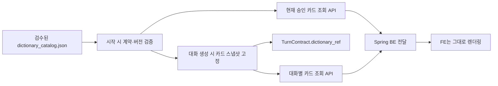
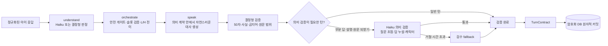

# 모르미 대화 API 아키텍처

## 1. 책임 경계

이 API는 화면을 직접 그리지 않지만, **집 가르치기와 카페 세션의 교육적 진행**을
담당한다.

집 반복학습 문제 풀이와 보상은 Spring이 원장으로 관리한다. 반복이 끝나면 Spring은
`curriculum_session_id`가 포함된 결과를 AI에 저장하고 `home_teach` 대화를 연다.
AI는 현재 검수된 36개 커리큘럼 카탈로그에서 해당 내용을 찾아 결정형 시나리오
스냅샷을 만든다. LLM은 학습목표·정답·힌트·별노트 문장을 새로 만들지 않는다.
직접 별노트는 분류기가 가리킨 아이 원문 근거를 코드가 실제 원문과 대조한 뒤,
카탈로그의 전략 중립적 `note_context`만 붙여 독립적으로 이해되는 문장으로 만든다.

현재 카페 프로토타입은 줄 서기·예산 메뉴 선택·메뉴값 계산·거스름돈의 4개 독립
시나리오만 제공한다. 5단계 통합 실습은 향후 범위이며 현재 라우팅과 콘텐츠 목록에
포함하지 않는다.

단계가 독립 대화이므로 각 화면은 해당 대화에 필요한 메뉴판과 모르미 메뉴를
`cafe_context`로 넘긴다. 현재 FE의 거스름돈 단계는 앞 단계 주문을 이어받지 않고,
모르미가 고른 메뉴 하나에 10,000원을 내는 독립 문제다.

Mormi-AI가 결정하는 것:

- 집 커리큘럼 ID에 대응하는 가르치기 과제 스냅샷
- 현재 스테이지와 하위 과제
- 현재 발화사다리 L, 힌트사다리 H, 하위 목표
- 응답 판정과 검증된 사실 슬롯
- 다음 질문, 입력 방식, 도움 카드, 시각 자료 종류
- 검수된 궁금해사전 카드와 대화별 고정 스냅샷
- 과제 완료와 다음 과제 진입
- 별노트 문장과 귀속
- 학습자별 다음 시작 L과 최근 H 사용 근거

Spring 백엔드가 담당하는 것:

- 사용자 인증과 학습자 식별
- 반복학습 결과와 장기 학습 기록의 최종 원장
- Mormi-AI 서비스 키 보관과 서버 간 호출
- AI 대화 결과의 별노트·프로필 변경값을 서비스 데이터에 반영
- 프론트엔드에 `TurnContract` 전달
- 카페 방문 진행도 원장(어느 단계까지 왔는지)
- 집 반복 시도 저장, `PracticeResult` 생성과 AI 대화 프록시

줄 서기·메뉴 선택·메뉴값 계산·거스름돈의 정오 판정은 이 서비스가 소유한다. 백엔드는 그
단계들을 다시 채점하지 않고 결과만 기록한다. 같은 문제를 두 곳이 채점하면
서로 다른 답을 낼 수 있다.

프론트엔드가 담당하는 것:

- 배경, 모르미 캐릭터, 말풍선, 도움 카드 렌더링
- 선택지, 수 세기, 세로식 등 조작 UI
- 음성 인식이 추가될 경우 STT 실행과 ASR confidence 전달
- TurnContract가 지정한 입력 외의 정답 판정은 하지 않음
- 궁금해사전 문구를 도움카드나 FE 상수로 합성하지 않고 AI의 카드 계약을 렌더링

```text
프론트엔드 → Spring Boot → FastAPI Mormi-AI
                         ← TurnContract
             ← 인증·서비스 데이터와 결합한 응답
```

### 1.1 궁금해사전·도움카드·별노트의 분리

세 요소는 비슷한 문장을 보여 줄 수 있지만 출처와 목적이 다르다.

| 요소 | 목적 | 내용의 출처 |
|---|---|---|
| 궁금해사전 | 언제든 믿고 다시 보는 개념 참고 자료 | 승인·버전 고정 AI 콘텐츠 카탈로그 |
| 도움카드 | 현재 문제에서 다음 행동을 H1→H3로 지원 | 과제별 `help_plan` |
| 별노트 | 아이가 실제로 알려 준 근거를 기록 | 검증된 아이 원문 또는 공동 수행 결과 |

궁금해사전은 도움카드 문구나 별노트 문장을 재사용하지 않으며 런타임 LLM이 생성하지
않는다. 각 카드는 독립적으로 이해되는 개념, 구체적 예시, 예시 사실과 일치하는 전용
시각자료, 출처, 사람 승인, 콘텐츠 버전과 SHA-256 해시를 가진다.



대화 스냅샷은 과제별 카드 본문을 세션 상태에 저장한다. 배포 중 카탈로그가 바뀌어도
이미 시작된 아이에게 문장이 바뀌지 않는다. 구버전 대화처럼 스냅샷이 없는 경우 최신
카드를 몰래 대입하지 않고 `409`로 명시해 혼합 버전을 막는다. 사전 조회는 L/H, 슬롯,
별노트와 턴 상태를 전혀 변경하지 않는 읽기 전용 동작이다.

출시 전 검수는 세 겹이다.

1. 코드: 36개 집·4개 카페 과제 전수 대응, ID·승인·출처·해시, 문장 독립성,
   산술과 시각 사실 일치, 도움카드 복사, 누락·고아 카드를 검사한다.
2. 오프라인 AI: 이해 가능성, 수학 정확성, 특정 풀이법 강요, 도움카드와 의미 중복을
   콘텐츠 등록 전에만 검사한다.
3. 사람: 개념·예시·전용 시각자료·연결 과제와 H1~H3를 한 검수표에서 읽고 승인한다.

카탈로그나 버전 매니페스트가 계약을 위반하면 서버 시작과 CI를 실패시킨다. 문구를
바꾸려면 `content_version`과 승인 기록을 함께 갱신해야 하므로 조용한 콘텐츠 교체가
불가능하다.

## 2. 집 반복학습에서 가르치기로 전환

```text
FE 반복 문제 5회
  → Spring이 시도별 결과 저장
  → POST /v1/practice-results
       curriculum_session_id + 집계 결과
  → POST /v1/conversations
       scene=home_teach, scenario_id=home_teach, practice_result_id
  → AI가 검수 카탈로그에서 시나리오 생성·DB 고정
  → 이후 모든 질문/응답을 conversation_id 아래 저장
```

AI DB에는 생성된 시나리오 스냅샷, 턴 계약, 구조화 판정, 별노트가 항상 저장된다.
현재 파일럿은 사전 동의를 전제로 하므로 아이의 원문 발화와 선택 응답을 암호화해
만료 없이 저장한다. 여러 턴의 별노트 출처를 이어 주는 `child_note_evidence`도 세션
상태 JSON에 평문으로 넣지 않고 같은 암호화 키로 저장한 뒤 엔진 로드 시에만 복호화한다.

## 3. LangGraph 턴 워크플로



LangGraph에는 per-turn 임시 상태만 흐른다. 아이 원문을 LangGraph 체크포인터에 다시 저장하지 않는다. 영속 세션 상태와 원문 기록은 암호화 애플리케이션 DB가 단일 기준이다.

`understand`의 구현은 입력 방식에 따라 둘로 나뉘지만 출력 형식은 동일하다.

- 자유문장: Haiku가 정답·부분정답·오개념·막힘·안전 유형과 사실별 claim을 구조화한다.
- 선택·빈칸·수 세기·조작: 검수된 선택 ID와 슬롯 정답을 코드가 결정형으로 판정한다.

선택형을 LLM에 다시 묻지 않는 이유는 화면에 표시한 선택 ID의 의미와 정답을 서버가
이미 알고 있기 때문이다. 두 경로 모두 `UtteranceAnalysis`를 생성한 후 같은
`orchestrate → speak → validate_and_compose` 경로를 통과한다.

대화 정책 v3부터 모든 새 집 가르치기는 검수된 `genuine_question` 또는 막힌 지점을
드러내는 도움 요청으로 시작한다. 모르미는 정답·오답 후보를 먼저 제시하지 않는다.
현재 카탈로그에 `wrong_guess`가 들어오면 서버 시작 시 검증에 실패한다.

v2에서 이미 저장된 세션을 갑자기 끊지 않기 위해 `entry_stance`, `entry_phase`,
`entry_prompt` 해석 코드는 호환용으로만 남긴다. 새 세션의
`dialogue_policy_version=3`, `entry_phase=resolved`이며 이 경로를 활성화하지 않는다.

완료에는 이중 게이트를 적용한다. 분석 결과가 `correct_full`, `correct_partial` 또는
`self_correction`이어야 하고, 동시에 claim 값이 검수된 슬롯 정답과 일치해야 한다.
`conceptual_error`로 판정된 선택지는 값이 함께 들어와도 슬롯을 채우거나 세션을
완료할 수 없다. 단일 선택 턴은 현재 화면의 `choice_id` 정확히 하나만 허용한다.

줄 인원은 세션 생성 시 한 번 정한다. 메뉴판·가격·이미지 경로·모르미 메뉴·예산은
프론트가 `SessionCreate.cafe_context`로 보낸다. AI 서버는 실제 메뉴 카탈로그를
소유하지 않고 전달받은 스냅샷을 `SessionState.scenario_data`에 고정한다. 따라서
새로고침, 서버 복구와 같은 `response_id` 재전송에서도 문제가 바뀌지 않는다.

운영 환경에서는 브라우저가 FastAPI를 직접 호출하지 않는다. 프론트가 BFF 또는
Spring 백엔드를 거쳐 메뉴 스냅샷을 전달하며, 서비스 간 키로 호출을 보호한다.
Spring에 정식 메뉴 카탈로그가 생기면 전달 가격을 그 카탈로그와 대조하는 것이
권장된다.

예산 메뉴 고르기의 합계는 전달받은 가격으로 결정형 코드가 계산해 화면에 보여준다.
예산을 넘으면 아이를 오답으로 평가하지 않고 시스템의 예산 상태를 보여준 뒤 같은
메뉴 선택 과제를 유지한다.

## 4. 발화사다리와 힌트사다리

설계 원본의 L4~L0, H0~H3을 별도 상태값으로 유지한다.

- 표현 막힘: `L↓`, `H 유지`
- 개념 오답/막힘: `L 유지`, `H↑`
- 부분 성공: 검증된 슬롯을 유지하고 빠진 슬롯 하나 요청
- 입력 인식 오류: L/H 모두 유지
- H2에서도 관계 연결 실패: H2를 유지하며 L1로 단계 분해
- L1-H2에서도 실패: L0-H3 공동 수행

집 반복학습의 정답률과 가르치기 표현 수준은 분리한다. 반복에서 틀린 문제는
개념 수행 근거로 저장하되, 집 가르치기의 첫 턴은 항상 `L4-H0`으로 열어 아이가
자기 말로 가르칠 기회를 먼저 보장한다. 발화사다리는 그 첫 반응을 관찰한 뒤에만
내려간다.

L4 도움 요청에 답과 이유·방법을 모두 말하면 한 턴에 완료할 수 있다. 답만 말하면
그 슬롯을 보존하고 발화사다리 수행 인정은 L4로 유지한 채
`AWAITING_TARGETED_FOLLOWUP`에서 빠진 이유·방법만 짧게 묻는다. 이 후속 질문까지
독립적인 텍스트로 해결하면 L4 수행으로 기록한다. `잘 모르겠어`, 개념 오답, 표현
막힘이 발생할 때에만 기존 L/H 정책을 적용한다. 장난·위험 발화·인식 실패는 L/H나
검증 슬롯을 바꾸지 않는다.

힌트는 자동 공개되는 `help_card`가 제공한다. 모르미 대사는 카드 내용을 자신의 지식처럼 말하지 않는다.

## 5. 자연스러운 전환

발화사다리 하강은 다음 구조를 사용한다.

1. 아이 반응을 실패로 규정하지 않음
2. 모르미가 질문 방식의 부담을 책임짐
3. 같은 문제와 숫자를 유지함
4. 더 작은 도움 하나만 요청함

예:

- L4→L3: “내가 한꺼번에 많이 물어봤네. 어느 줄인지 먼저 알려줘.”
- L3→L2: “말로만 들으려니 내가 헷갈려. 같이 골라볼까?”
- L2→L1: “어디부터 볼지 몰랐네. 사람 수부터 하나씩 볼까?”
- L1→L0: “도움 카드 순서대로 나와 같이 해볼까?”

## 6. 사실 슬롯과 원문

모르미 화자는 착하고 순한 초등 저학년 동생의 말투를 유지한다. 맞춤법은 지키되
교사처럼 퀴즈를 내거나 시스템처럼 상태를 보고하지 않는다.

- 아이가 알려준 사실에는 “아, 그렇구나!”, “아, 세 개구나!”처럼 즉시 반응한다.
- 아이의 생각을 검사하는 “왜 그렇게 생각했어?”, “어떻게 알았어?”는 쓰지 않는다.
  대신 “나는 무엇을 어떻게 봐야 할지 헷갈려... 알려줄 수 있어?”처럼 모르미 자신의
  구체적인 빈칸을 먼저 드러내고 도움을 청한다.
- `...`은 모르는 마음을 조심스럽게 꺼내는 도움 요청에만 최대 한 번 사용한다. 밝게
  이해한 반응·성공·안전 대응에는 붙이지 않고, 과한 자기비하나 불쌍한 연기로 쓰지 않는다.
- “그 부분은 기억했어”, “확인했어”, “네가 말한 데까지” 같은 상태 보고형 표현은
  콘텐츠 검수와 화자 출력 검증에서 차단한다.
- 문제 카드의 중립 문구와 모르미의 대사를 구분한다. 모르미는 “몇 개일까?”처럼
  시험하듯 묻기보다 “몇 개야?”, “알려주면 안 될까?”처럼 도움을 청한다.
- 부분 답변을 받으면 확보한 슬롯을 보고하지 않고 자연스럽게 받아 준 뒤, 빠진 한
  가지만 다시 부탁한다.
- 이미 검증된 사실만 반복되면 새 진전으로 세지 않는다. 같은 질문을 다시 내보내지
  않고 표현 단계를 한 칸 낮추며, L0에서는 H3 도움 카드의 공동 수행으로 전환한다.
- 검증된 학습자 이름이 대화 계약에 없으면 임의로 이름을 만들어 부르지 않는다.

```text
암호화 원문 기록: 질문 + 아이 원문/선택
학습 상태: 검증된 슬롯만
화자 LLM: 검증 슬롯 + 빠진 슬롯 + 허용된 아이 표현만
별노트: 원문 근거 + 검수된 중립 맥락, 또는 검수된 공동 문장
```

분류기는 자연스러운 후속 질문에 유용한 안전한 아이 원문 일부를
`grounding_span`으로 별도 지정할 수 있다. 코드는 이 구절이 실제 원문에 그대로 있고,
30자 이내이며, 안전하고, 포함된 수가 검증된 수량과 일치할 때만 `quote_safe`로
화자에게 전달한다. 조건을 하나라도 만족하지 않으면 원문은 `none`이며, 위험·개인정보·
해킹 발화는 항상 차단한다. “차근차근 세어 봐”처럼 관련 있지만 구체적이지 않은 말은
완성된 방법 슬롯으로 부풀리지 않고, 그 표현의 뜻만 자연스럽게 되물을 수 있다.

### 6.1 화자 의미 계약과 조건부 검증

자연스러움을 위해 문장 전체를 하드코딩하지 않지만, Sonnet에 교육 결정을 넘기지도
않는다. 오케스트레이터가 화자에게 주는 계약에는 다음만 포함된다.

- 코드가 검증한 사실과 아직 빠진 슬롯
- 이번 대사의 행동(`dialogue_act`)과 질문해야 할 의미
- 허용된 수량과 안전하게 되받을 수 있는 아이 원문 구절
- 검수된 fallback 문장

정답이 아직 필요한 슬롯의 실제 정답과 금지 답 형태는 화자에게 보내지 않고
검증기만 가진다. 모든 후보는 길이·질문 수·금지어·허용 수량·원문 인용 범위를
결정형 코드로 검사한다. 부분 답을 받아 자연스럽게 이어 말하는 턴, 설명·방법을 묻는
턴, 아이 표현을 되받는 턴은 추가로 Haiku 의미 검증을 거쳐 같은 슬롯만 묻는지,
정답을 새로 알려 주지 않는지, 교사 말투로 아이를 평가하지 않는지 확인한다.

단순 안전 대응, 도움 카드, 공동 수행, 완료 대사는 검수 문구를 바로 사용하며 추가
검증 호출을 하지 않는다. 일반적인 단순 질문도 결정형 검증만 사용한다. 의미 검증이
시간 제한을 넘거나 거절되면 교육 상태는 되돌리지 않고 검수된 fallback 문장만 쓴다.
따라서 검증 AI는 모든 턴의 고정 지연이 아니라 자연스러운 표현이 필요한 위험 턴의
선택적 안전망이다.

### 6.2 안전한 SSE 스트리밍

`run_turn_stream`은 LangGraph의 `understanding → planning → speaking → validating`
진행 이벤트를 즉시 내보낸다. 모델의 원시 생성 토큰은 전송하지 않는다. 검증 전
토큰을 먼저 보여 주면 뒤에서 위반을 발견해도 이미 아동 화면에 노출되기 때문이다.

최종 문장이 모든 검증을 통과하고 DB에 저장된 뒤 `mormi.delta`로 잘라 보내며,
마지막 `turn.completed`가 화면 상태의 권위 있는 전체 계약이다. 비스트리밍 API도
동일한 서비스 메서드와 멱등 커밋 경로를 소비하므로 두 API의 교육 진행은 갈라지지
않는다.

별노트에는 더 강한 출처 계약을 적용한다.

- `answer`와 일반화·방법 슬롯을 분리한다. `오른쪽이 커`, `600원이야`처럼 결론만
  있는 응답은 다음 질문을 진행할 수 있지만 별노트 근거가 되지 않는다.
- `text_explanation_slots`는 분류기 claim 외에도 설명형 원문 근거 검사를 통과해야
  채워진다. 분류기가 결론을 까닭으로 과대 판정해도 세션이 조기 완료되지 않는다.
- 직접 설명은 `SlotClaim.evidence_span`이 아이 원문에 실제로 존재할 때만 저장한다.
- 한 발화에 맞는 말과 틀린 말이 섞이면 사실 슬롯의 정확한 원문 구절만 사용한다.
- 직접 노트는 `note_context + 아이 근거`로 완결하되, 교안의 모범 전략이나 힌트를
  끼워 넣지 않는다.
- 선택·빈칸·공동 읽기로 완성한 경우에만 검수된 `coauthored_note`를 사용하고
  `아이와 같이 공부함`으로 귀속한다.
- 근거가 부족하면 과제가 끝나더라도 노트를 만들지 않는다. 완료 자체는 노트의
  출처가 아니다.
- 완료·과제 전환 대사는 수학적 주장을 덧붙이지 않는 검수 문구를 사용해 화자 LLM이
  아이가 말하지 않은 전략을 성공 문구에 추가할 수 없게 한다.

## 7. 실패 정책

- 분류기 실패: 상태를 바꾸지 않고 503 반환
- 화자 실패: 결정된 교육 진행은 유지하고 검수된 fallback 대사 사용
- 출력 검증 실패: 검수된 fallback 대사 사용
- 조건부 의미 검증 거절·시간 초과: 추가 재호출 없이 검수된 fallback 대사 사용
- 동일 `response_id` 재전송: 상태를 중복 진행하지 않고 최초 생성된 결과 턴 반환
- 오래된 `turn_id`: 409 반환
- 부분 오답: 맞은 슬롯만 저장하고 틀린 슬롯은 저장하지 않음
- 기존 세션 스냅샷: `dialogue_policy_version=1`로 예전 L4 질문을 그대로 이어 감

## 8. 저장

주요 테이블:

- `conversations`: 구조화된 최신 교육 상태
- `turns`: 암호화 질문·원문 응답과 구조화 판정
- `learner_profiles`: 기술별 안정 L, H0 성공, 최근 최대 H
- `practice_results`: 집 반복 결과
- `notes`: 별노트 문장과 직접/공동 귀속

운영에서는 PostgreSQL, 원문 암호화 키, 서비스 API 키를 강제한다.

파일럿 참여자는 사전 동의를 완료한 것으로 전제해 기본값을
`conversation_storage_consent=true`, `retention_policy=permanent`로 둔다. 질문과 아이
원문·선택 응답은 암호화해 만료 없이 저장하고, 턴 계약 JSON에는 평문을 중복 저장하지
않는다. 영구 정책에서는 `response_id`의 멱등 결과도 만료시키지 않는다.
