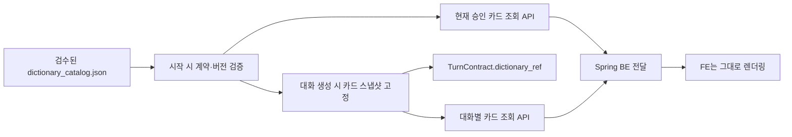
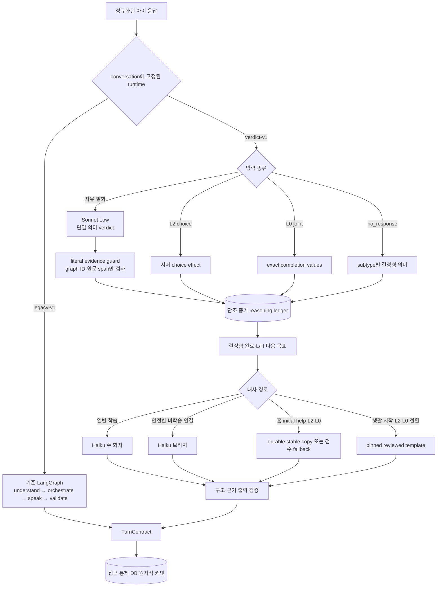

# 모르미 대화 API 아키텍처

## 1. 책임 경계

이 API는 화면을 직접 그리지 않지만, **집 가르치기와 카페·놀이동산 세션의 교육적 진행**을
담당한다.

집 반복학습 문제 풀이와 보상은 Spring이 원장으로 관리한다. 반복이 끝나면 Spring은
`curriculum_session_id`가 포함된 결과를 AI에 저장하고 `home_teach` 대화를 연다.
AI는 현재 검수된 36개 커리큘럼 카탈로그에서 해당 내용을 찾아 대화 스냅샷을 만든다.
그중 9개에는 `verdict-v1` 네이티브 팩과 엔진이 연결되어 있고, canary 비선택 요청과
나머지 범위는 `legacy-v1` adapter로 실행한다. LLM은 학습목표·정답·힌트·완료 계약을
새로 만들지 않는다.
직접 별노트는 분류기가 가리킨 아이 원문 근거를 코드가 실제 원문과 대조한 뒤,
카탈로그의 전략 중립적 `note_context`만 붙여 독립적으로 이해되는 문장으로 만든다.

카페 진행 필수 5개와 놀이동산 개념 준비 4개 집 세션은 별도
`dialogue_v2_required_home_catalog.json`에 네이티브 팩으로 먼저 정의했다. 각 팩은
AI 소유 가르치기 예시, typed fact·relation graph, completion target, L2 choice effect,
L0 completion value, H1~H3 공개 범위와 stable copy 생성 계약을 한 revision으로 묶는다.
`dialogue_v2_content.py`는 참조·cycle·완료값·말투뿐 아니라 typed 산술식, source visual과
public/perceptual fact binding, source 정답·L2·L0·H3의 canonical 일치, H0 풀이 누설을
시작 전에 strict하게 검증한다. H1/H2는 선언되지 않은 값이나 required truth를 공개할 수
없고, H3의 사람이 쓴 식도 다시 계산해 잘못된 등식을 거절한다.

반복학습과 가르치기는 같은 `curriculum_session_id`의 개념으로 연결되며 문제 자체가 같을
필요는 없다. BE의 `practice_summary`에는 실제 마지막 FE 문제의 원문·정답·visual이 없으므로,
AI는 `item_id`나 FE `variant_seed`로 마지막 문제를 재구성하지 않는다.

| 연결 | `curriculum_session_id` | V2 `pack_id` |
|---|---|---|
| 카페 필수 | `number-count` | `home.number-count.v2` |
| 카페 필수 | `number-compare` | `home.number-compare.v2` |
| 카페 필수 | `money-count` | `home.money-count.v2` |
| 카페 필수 | `money-price` | `home.money-price.v2` |
| 카페 필수 | `money-budget` | `home.money-budget.v2` |
| 놀이동산 준비 | `multiply-groups` | `home.multiply-groups.v2` |
| 놀이동산 준비 | `divide-share` | `home.divide-share.v2` |
| 놀이동산 준비 | `divide-group` | `home.divide-group.v2` |
| 놀이동산 준비 | `multiply-easy-tables` | `home.multiply-easy-tables.v2` |

V2 router와 엔진은 `ConversationService`에 연결되어 있다. 신규 대화 생성 때만 eligibility와
canary를 계산하고 선택한 `runtime_contract_version`을 저장한다. 집 9개 팩과 카페 4개,
놀이동산 3개 시나리오는 네이티브 대상이다. 대상 밖이거나 안정적인
`learning_session_id`가 없는 요청은 `legacy-v1` adapter 경계로 명시적으로 고정한다.
이후 응답·조회·같은 회차 생성 재시도는 현재 설정으로 다시 선택하지 않고 저장된 엔진만
사용한다.

현재 카페 제품 여정은 줄 서기·메뉴값 계산·거스름돈의 3개 독립 시나리오를 제공한다.
메뉴값 계산 화면에서는 모르미가 메뉴 하나를 무작위로 정하고 아이가 다른 메뉴 하나를
직접 고른 뒤, 두 선택을 하나의 합산 문제로 고정한다. 이 화면 선택은 별도 학습
스테이지나 정오 판정이 아니다. `cafe_budget_menu`는 진행 중인 구버전 대화 복구를
위한 호환 시나리오로만 유지한다.

놀이동산은 표 값 곱셈·간식값 똑같이 나누기·자유이용권 손익분기 비교의 3개 독립
시나리오를 제공한다. 교육 콘텐츠의 단일 원장은 Mormi-AI다. 검수된 범위와 제약 안에서
문제 수를 고르고, 정답·오개념·L/H 문구·시각자료·전이 문제를 하나의 대화 스냅샷으로
고정한다. Spring BE는 방문 권한과 스테이지 진행만 소유하고 `scenario_id`만 보낸다.

단계가 독립 대화이므로 각 화면은 해당 대화에 필요한 메뉴판과 모르미 메뉴를
`cafe_context`로 넘긴다. 합산 단계는 아이가 화면에서 직접 고른 다른 메뉴의 ID도
함께 넘긴다. 현재 FE의 거스름돈 단계는 앞 단계 주문을 이어받지 않고, 모르미가 고른
메뉴 하나에 10,000원을 내는 독립 문제다.

Mormi-AI가 결정하는 것:

- 집 커리큘럼 ID에 대응하는 가르치기 과제 스냅샷
- 놀이동산 기본·전이 문제 생성, 산술 검증과 대화별 불변 스냅샷
- 현재 스테이지와 하위 과제
- 현재 발화사다리 L, 힌트사다리 H, 하위 목표
- 응답 판정과 검증된 사실 슬롯
- 다음 질문, 입력 방식, 도움 카드, 시각 자료 종류
- 검수된 궁금해사전 카드와 대화별 고정 스냅샷
- 과제 완료와 다음 과제 진입
- 별노트 문장과 귀속
- 학습자별 다음 시작 L과 최근 H 사용 근거

Spring 백엔드가 담당하는 것:

- 사용자 인증과 학습자 식별
- 반복학습 결과와 장기 학습 기록의 최종 원장
- Mormi-AI 서비스 키 보관과 서버 간 호출
- AI가 발행한 별노트 이벤트를 멱등 수집해 서비스용 별노트 원장과 조회 API로 제공
- 프론트엔드에 `TurnContract` 전달
- 카페 방문 진행도 원장(어느 단계까지 왔는지)
- 놀이동산 방문·스테이지 해금 원장과 AI 완료 증거의 구조 검증
- 집 반복 시도 저장, `PracticeResult` 생성과 AI 대화 프록시

줄 서기·메뉴값 계산·거스름돈의 의미 판정은 이 서비스가 소유한다. 화면에서 아이가
메뉴를 고르는 행위는 합산 문제의 공개 사실을 정하는 설정이며 정오 판정 대상이 아니다.
백엔드는 AI의 의미 판정을 뒤집지 않고 완료 사실을 서비스 진행도와 대조해 기록한다.

프론트엔드가 담당하는 것:

- 배경, 모르미 캐릭터, 말풍선, 도움 카드 렌더링
- 선택지, 수 세기, 세로식 등 조작 UI
- 음성 인식이 추가될 경우 STT 실행과 ASR confidence 전달
- TurnContract가 지정한 입력 외의 정답 판정은 하지 않음
- 궁금해사전 문구를 도움카드나 FE 상수로 합성하지 않고 AI의 카드 계약을 렌더링
- 별노트 모아보기는 Spring의 학습자별 조회 API만 사용하고 AI DB를 직접 조회하지 않음
- 놀이동산 문제 사실은 AI `TurnContract.visual`만 렌더링하고 자체 문제를 만들지 않음

```text
프론트엔드 → Spring Boot → FastAPI Mormi-AI
                         ← TurnContract
             ← 인증·서비스 데이터와 결합한 응답
```

### 1.1 궁금해사전·도움카드·별노트의 분리

세 요소는 비슷한 문장을 보여 줄 수 있지만 출처와 목적이 다르다.

| 요소 | 목적 | 내용의 출처 |
|---|---|---|
| 궁금해사전 | 언제든 믿고 다시 보는 개념 참고 자료 | 승인·버전 고정 AI 콘텐츠 카탈로그 |
| 도움카드 | 현재 문제에서 다음 행동을 H1→H3로 지원 | 과제별 `help_plan` |
| 별노트 | 아이가 실제로 알려 준 근거를 기록 | 검증된 아이 원문 또는 공동 수행 결과 |

궁금해사전은 도움카드 문구나 별노트 문장을 재사용하지 않으며 런타임 LLM이 생성하지
않는다. 각 카드는 독립적으로 이해되는 개념, 구체적 예시, 예시 사실과 일치하는 전용
시각자료, 출처, 사람 승인, 콘텐츠 버전과 SHA-256 해시를 가진다.



대화 스냅샷은 과제별 카드 본문을 세션 상태에 저장한다. 배포 중 카탈로그가 바뀌어도
이미 시작된 아이에게 문장이 바뀌지 않는다. 구버전 대화처럼 스냅샷이 없는 경우 최신
카드를 몰래 대입하지 않고 `409`로 명시해 혼합 버전을 막는다. 사전 조회는 L/H, 슬롯,
별노트와 턴 상태를 전혀 변경하지 않는 읽기 전용 동작이다.

### 1.2 별노트 B안: 독립 도메인 이벤트

별노트는 관찰 이벤트의 부가 문자열이 아니라 생성·조회·향후 비활성화 생명주기를 가진
서비스 데이터다. AI는 별노트 문장·귀속·근거를 결정하고, 별노트·근거 링크·outbox row를
같은 DB 트랜잭션에 저장한다. 백그라운드 worker는 기존 Spring 수신 URL에
`event_type=star_note_created`인 별도 이벤트를 보낸다.

```text
AI 턴 확정
  ├─ dialogue_observation outbox
  └─ star_note_created outbox  ← 별노트가 생긴 완료 턴에만
                    ↓
Spring 멱등 수집(event_id, note_id)
                    ↓
학습자별 별노트 원장·조회 API
                    ↓
FE 별노트 모아보기
```

- `event_id`: 같은 전송 재시도를 중복 반영하지 않는 전송 멱등 키
- `note_id`: 서비스 별노트 원장의 도메인 멱등 키
- `note_version`: 향후 수정·비활성화 이벤트를 구분할 버전
- `evidence_links`: 아이 원문 대신 관찰 ID와 검증 슬롯 ID만 전달
- 전달 순서: 관찰과 별노트 이벤트의 도착 순서를 가정하지 않음

Spring은 별노트가 관찰보다 먼저 와도 저장 후 나중에 연결하거나 명시적인 재시도 가능
`409`를 반환해야 한다. AI는 Spring 계약이 배포되기 전까지
`MORMI_STAR_NOTE_EVENTS_ENABLED=false`로 별노트 이벤트를 pending에 보존하고, 계약 배포
후 `true`로 전환해 적체분을 전송한다. 이 순서로 AI 선배포 시 422 영구 실패를 막는다.

출시 전 검수는 세 겹이다.

1. 코드: 36개 집·4개 카페·3개 놀이동산 과제 전수 대응, ID·승인·출처·해시, 문장 독립성,
   산술과 시각 사실 일치, 도움카드 복사, 누락·고아 카드를 검사한다.
2. 오프라인 AI: 이해 가능성, 수학 정확성, 특정 풀이법 강요, 도움카드와 의미 중복을
   콘텐츠 등록 전에만 검사한다.
3. 사람: 개념·예시·전용 시각자료·연결 과제와 H1~H3를 한 검수표에서 읽고 승인한다.

카탈로그나 버전 매니페스트가 계약을 위반하면 서버 시작과 CI를 실패시킨다. 문구를
바꾸려면 `content_version`과 승인 기록을 함께 갱신해야 하므로 조용한 콘텐츠 교체가
불가능하다.

## 2. 집 반복학습에서 가르치기로 전환

```text
FE 반복 문제 5회
  → Spring이 시도별 결과 저장
  → POST /v1/conversations
       scene=home_teach, scenario_id=home_teach
       learning_session_id + conversation_round
       practice_result_id + 인라인 practice_summary
  → AI가 검수 카탈로그에서 시나리오 생성·DB 고정
  → 이후 모든 질문/응답을 conversation_id 아래 저장
```

현재 Spring 운영 경로는 별도의 `POST /v1/practice-results` 호출 없이 대화 생성 요청에
구조화된 `practice_summary`를 인라인으로 보낸다. 독립 저장 API는 다른 서버 연동이나
사전 적재가 필요한 경우에만 선택적으로 사용한다. 동일 시나리오의 네트워크 재시도는
같은 `conversation_round`를 사용하고, 명시적 재시작은 해당 시나리오의 회차를 증가시켜
새 대화를 만든다. DB 멱등 identity는
`(learner_id, learning_session_id, scene, scenario_id, conversation_round)`이며 한 방문 ID로
여러 카페·놀이동산 시나리오를 열어도 서로 충돌하지 않는다.
동시 생성의 lookup-then-insert 경쟁은 이 DB unique key를 최종 승자 선출 경계로 삼고,
패배한 요청이 커밋된 승자의 persisted snapshot을 다시 읽는 방식으로 수렴시킨다.

AI DB에는 생성된 시나리오 스냅샷, 턴 계약, 구조화 판정, 별노트가 항상 저장된다.
현재 파일럿은 사전 동의를 전제로 하므로 아이의 원문 발화와 선택 응답을 평문으로
만료 없이 `turns`에 저장한다. V2/V3의 여러 턴 별노트 provenance는 relation ID, 원문 offset을
가리키는 opaque evidence ID와 source turn만 상태에 두며 아이 원문을 snapshot JSON에
복제하지 않는다.

## 3. 대화 엔진과 턴 워크플로

신규 conversation router는 `legacy-v1`과 `verdict-v1` 중 하나를 한 번 선택해 상태에
고정한다. 집 9개와 카페 4개·놀이동산 3개 네이티브 시나리오의 canary-selected 대화는
V2 엔진을 사용하고 나머지 범위는 기존 LangGraph 엔진을 사용한다. 홈 V2는 단일 pack
snapshot, 생활 V2는 task-scoped V3 scenario snapshot을 사용한다. 두 엔진은 같은
`TurnContract`와 저장·멱등 API 경계를 유지한다.



기존 LangGraph에는 per-turn 임시 상태만 흐른다. 아이 원문을 체크포인터에 다시 저장하지
않는다. V2도 최근 6개 질문·응답을 repository에서 읽어 이해 요청에만 사용한다. 두 엔진의
영속 상태와 평문 원문 기록은 접근이 통제된 애플리케이션 DB가 단일 기준이다.

### 3.1 V2 자유 발화: 의미 판정, literal evidence, reasoning ledger

#### V2 실행 그래프 리팩터링 (2026-08-31)

`codex/v2-langgraph-parity-refactor`는 교육 정책을 바꾸지 않고 실행 제어만 분리한다.
`dialogue_v2_runtime.py`의 요청별 `_TurnExecution`은 원 과제 context와 복사한 다음 상태를
분리한다. `dialogue_v2_graph.py`는 입력 종류 → 정책 적용 → 완료/대사 분기 → 응답 구성 →
별노트의 순서를 명시한다. `dialogue_v2_attempt_graph.py`는 기존 이해·화자의 최대 두 번
시도만 표현하며 새로운 재판정, 자동 RetryPolicy, backoff나 모델 호출을 추가하지 않는다.

현재 공개 `run_turn_stream`은 전체 turn graph를 실행하고, 이해·화자 제한 재시도는
서브그래프를 사용한다. 추가 내부 처리 비용을 사용자가 승인한 뒤 기본 경로로 전환했으며
임시 순차 실행 경로와 `_run_turn_graph` 진입점은 제거했다. 기존 Python 실행기는 테스트
전용 기준 fixture에만 남는다. 기존 V2 canary 설정은 old/new 실행기를 선택하는 스위치가 아니다.
턴 그래프 전환은 PR #52로 `develop@9708953`에 병합되었다. 아래 부모 그래프는
그와 별도의 opt-in 작업이며 기본 실행 경로에는 아직 활성화하지 않는다.

- 턴·재시도 그래프는 엔진마다 한 번 compile하며 `checkpointer=False`로 부모의 저장기
  상속까지 차단한다. 영속 DB/snapshot 계약은
  그대로이고, 요청별 임시 graph state를 모델이나 외부 tracing에 전달하지 않는다.
- 진행 이벤트는 작업 **전**에 내보내고 소비자가 다음 이벤트를 요청할 때 작업을 시작한다.
  서비스와 HTTP 스트림의 종료도 엔진까지 전파하여 미완료 그래프 작업을 취소한다.
- 내부 DEBUG 진단은 대화/턴 ID, 노드, 시도 수, 시간, 상태만 기록한다. 원문·모델 요청·
  graph state는 기록하지 않으며 기존 영속 audit 스키마는 바뀌지 않는다.
- 기준 커밋 `a8c82ff`의 실행기 원본을 테스트 전용 fixture로 고정했다. 모델·캐시 요청과
  응답 순서, 결과 전체, DB 전체 행, 과제 전환·별노트·재전송을 비교한다. 기존 실행기의
  결과를 새 구현에 맞춰 갱신하지 않으며 latency 값만 정규화한다.
- 기본 전환 후 1,096개 테스트, ruff, mypy가 통과했다. 중간 단계의 1,188개에서 임시 순차
  경로의 중복 실행 92개만 제거했고, 고정 기준 실행기와의 비교는 유지했다.
  전환 전 실제 Sonnet·Haiku 각 1회 계약 smoke도 통과했다.
  실제 모델 smoke는 전체 그래프의 확률적 대화 품질 검사나 동등성 증명이 아니다.
- 모델 대기 없는 100회 warm 측정: 기존 p95 8.03ms → 후보 11.56ms, +3.53ms.
  평균 시간 기반 합성 처리량 감소는 31.99%다. 추가 p95 ≤20ms 조건은 통과하지만
  감소 ≤10% 조건은 실패했다. 실제 운영 처리량 감소율로 해석하지 않는다. 사용자가 이 비용을
  허용해 기본 전환을 승인했다. 전환 후 추가 측정은 +4.38ms/34.64%로 같은 규모였으며,
  벤치마크의 원래 `cpu_budget_passed=false` 결과를 통과로 바꾸지 않았다.

#### 선택적 세션 부모 그래프 (기본 비활성)

`session_parent_graph.py`는 한 conversation의 입력 대기 → 기존 턴 서비스 실행 →
다음 입력 대기/END를 관리한다. 생성 시 신규 V2 대화에만 실행 버전을 고정하고,
첫 응답에서 기존 초기 질문의 DB 상태를 읽어 부모를 지연 초기화한다. 이후 요청은
동일 `conversation_id`의 체크포인트를 복원하여 `interrupt`를 재개한다. 입력 원문은
일시적인 request context에만 전달하고 resume 값에는 응답 ID만 넣는다.

`dialogue_session_parents`는 대화 ID·DB 버전·대기 턴·graph 버전과 마지막 WAIT/END
체크포인트만 보존한다. 요청 중간 체크포인트는 요청별 메모리에 staging하고,
기존 `commit_turn` 및 기존 후처리가 끝난 뒤에만 경계 체크포인트를 DB에 투영한다.
원문·모델 응답·최근 대화·전체 SessionState·error pending write는 저장하지 않는다.
고정 크기 경계 JSON만 허용하고, 전체 대화 길이만큼 checkpoint history를 쌓지 않는다.

DB 학습 상태가 최종 기준이다. 커서가 누락·손상·지연되면 확정된 DB 상태에서 다시
WAIT/END를 만든다. 저장 후 응답 재전송에는 해당 응답의 원래 결과를 반환하고,
별노트·완료·outbox를 부모 END에서 다시 실행하지 않는다. 이전 writer는 DB state_version과
커서 generation으로 차단한다. 세션 완료 판정·과제 전환은 계속 기존 교육 엔진 소유다.

부모 기능은 기존 V2 canary와 독립적인 두 설정으로 제어한다. 기본은 비활성/0%이며,
활성화·DB migration·PostgreSQL 다중 프로세스 검증과 롤백 절차는
`docs/SESSION_PARENT_ROLLOUT.md`를 따른다. 이 변경은 BE/FE API, 리포트·발화사다리
분석 모델 입력, 교육 정책·프롬프트·콘텐츠·LLM 호출 예산을 바꾸지 않는다.

V2 자유 발화는 Sonnet Low가 현재 모르미 질문, 요청 중인 answer/reason target,
현재 L/H, 화면에 공개된 사실과 최근 6턴을 함께 보고 한 번에 구조화한다. Sonnet 응답은
fact·relation별 verdict와 현재 아이 원문에서 복사한 `evidence_span`을 가진다.

literal evidence guard는 다음 provenance 계약만 검사한다.

- claim의 fact/relation ID가 서버 소유 reasoning graph에 존재하는가
- auxiliary claim을 팩이 허용하는가
- `evidence_span`이 현재 아이 원문에 exact 또는 Unicode NFC 동등한 연속 구절로 존재하는가

guard는 기대값 비교, 산술 재계산, 단위 정규화, 의미 재판정 또는 verdict rewriting을 하지
않는다. 계약 위반이면 전체 이해 결과를 버리고 오류 코드만 넣어 Sonnet에 한 번 재시도하며,
두 번째도 실패하면 상태를 부분 진행하지 않는다. 별도의 adjudicator LLM도 없다.

통과한 `correct` fact 또는 `correct`/`sufficient` relation verdict는 팩의 canonical fact와
원문 위치·turn ID를 `ReasoningLedgerV2`에 기록한다. ledger는 `pack_id`,
`content_version`, `content_hash`에 묶이고 이미 검증된 사실·관계를 삭제하지 않는 단조 증가
구조다. 모델이 해석한 값을 고정 정답과 코드에서 다시 비교하지 않으며, partial·incorrect·
uncertain claim은 진행을 추가하거나 기존 진행을 지우지 않는다. 완료는 ledger에 팩의
required fact·relation ID가 모두 있는지만 결정형으로 계산한다.

### 3.2 V2 구조 입력과 무응답

V2 L2는 `TurnContract.input.choices`의 opaque `choice_id` 하나만 허용한다. 서버는
팩에 고정된 choice effect를 직접 ledger에 적용하므로 이해 LLM을 부르지 않는다. L0-H3의
`joint` 입력은 서버가 보낸 `input.config.completion_values`와 응답 `values`가 키·값·JSON
타입까지 정확히 같아야 한다. 누락, 추가 키, 값 위조, `1`과 `true` 같은 타입 바꾸기는
상태 변경 전에 거절한다.

`type=no_response`도 이해 LLM을 부르지 않으며 다음 세 원인을 구분한다.

- `explicit_help`: 아이가 도움을 요청했다. subtype을 보내지 않는 기존 FE 요청도 이 값이다.
- `silence_timeout`: 제한 시간 동안 발화가 없어 표현 지원 신호로 처리한다.
- `asr_empty`: 음성 인식 결과가 비어 학습 근거를 얻지 못했다.

세 경로 모두 새 fact·relation을 만들지 않는다. 특히 최초 `L4-H0`의 `explicit_help`는
팩의 `initial_help` stable-copy 슬롯으로 질문 부담을 낮추지만, 침묵·ASR 실패를 아이의
명시적 도움 요청으로 바꾸지 않는다.

현재 문제·도움 카드·풀이에 관한 아이의 역질문은 자유발화 이해 단계에서
`task_question`으로 분류한다. 세부 초점은 `reason_or_method`, `meaning`,
`confirmation_or_challenge` 세 가지뿐이며 별도의 촘촘한 질문 taxonomy를 만들지 않는다.
이 경로는 오답·무응답으로 처리하지 않고 ledger를 그대로 둔 채 H만 한 단계 올려 더 강한
검수 도움 카드를 연다. 카드의 본문·식·수·관계는 화자 입력에 넣지 않는다. Haiku는 아이
원문이나 문제 truth 없이 짧은 반응만 만들고, 서버가 opaque target의 중립 label로 현재
질문을 다시 붙인다. 따라서 모르미는 카드를 보고 스스로 풀이를 깨닫거나 아이에게 역으로
설명하지 않는다.

학습 claim과 대화 행동은 직교한다. `conversation_move`는 `task_question`,
`meta_question`, `request_mormi_answer`, `refusal`, `safe_play`를 최소 해상도로 보존하고,
실제 fact/relation claim은 별도 배열에 남긴다. safety/system class만 claim을 폐기한다.
provider가 legacy `utterance_class`와 새 축을 모순되게 반환해도 internal 변환에서 새 축과
실제 claim 존재 여부로 결정적으로 정규화하므로 혼합 메타+정답의 진전을 잃지 않는다.

### 3.3 V2 화자 모델과 stable copy

일반 학습 응답은 검증된 ledger fact, 허용 evidence와 다음 ask target만 받은 Haiku가
말투를 만든다. 안전한 거절·메타·가벼운 장난처럼 학습 상태를 바꾸지 않는 발화는 숨은
정답이나 아동 원문을 받지 않는 Haiku bridge가 interaction kind만으로 짧게 연결한다.
구조화 출력이 계약을 벗어나거나 모델이 실패하면 상태 결정은 유지하고 사람 검수
fallback으로 대체한다.

사회적 반응은 하나의 generic bridge 문구로 합치지 않는다. 결정형 response plan은
`request_mormi_answer`를 `decline_answer_and_ask`, 참여 거절을 `respond_refusal`, 과제
역질문을 `redirect_to_help_card`로 분리한다. 첫 경로는 모르미가 대신 풀 수 없다는 한계만,
두 번째는 거절을 복창·판단하지 않고 모르미의 궁금함만, 세 번째는 필요할 때 카드가 화면에
나왔다는 사실만 말한다. 카드 관찰 표현은 `도움 카드가 나왔어`처럼 쉬운 반말로 제한하고
카드 본문은 여전히 화자 입력에 넣지 않는다. 서버 재질문은 남은 target을 두 개일 때
`A(이)랑 B`로 조립하고, 거절과 도움 요청에 맞는 부탁 어미를 결정한다.

모델 출력에는 별도의 deterministic disclosure/privacy firewall을 적용한다. 현재 미해결
fact의 Choice/Text surface, 아라비아 숫자와 단위가 있거나 없는 한자어·고유어 수, L2의
개별 choice label을 차단한다. 이 검사는 아동 발화의 정오나 ledger를 바꾸지 않고 오직
아이에게 보여 줄 후보 문장만 거절한다. V2 main speaker와 bridge에는 raw evidence를 전혀
전달하지 않으므로 개인정보가 섞인 literal evidence도 canonical 진전과 evidence ID만
유지한다.

각 네이티브 **홈 팩**은 `initial_help` 1개, L2 answer/reason 질문 2개, L0 intro/action
2개씩 5개 stable-copy 슬롯을 가진다. 전체 9개 홈 팩의 45개 생성 계획은 아동 ID·원문·대화 이력
없이 pack hash, slot, prompt/schema/validator 버전, 모델과 generation config로 cache key를
만든다. `dialogue_generated_copy_cache`는 생성 lease와 retry backoff를 제공하고, 한 번
`ready`가 된 artifact를 변경하지 않는다. 실제 사용한 문구와 metadata는 conversation에도
고정되어 이후 캐시나 배포가 바뀌어도 진행 중인 대화 문구가 바뀌지 않는다.
`stable-copy-validator-v2`의 pack-aware firewall은 initial-help/L2의 hidden answer를
fallback·생성·hit·pinned·prewarm 모두에서 검사하며, hidden truth 자체는 모델 plan이나
cache artifact에 넣지 않는다. L0/H3의 식·답·방법은 아이가 보는 도움 카드와 joint UI에만
남긴다. 모르미 stable-copy plan에는 opaque target, 빈 visible facts와
`follow_visible_joint_ui` capability만 넣고 hidden-answer firewall도 유지한다. 진행 중
대화의 구 L0 plan은 읽기 호환하되 runtime 생성·cache artifact 경로를 우회해 내용 비의존
검수 문구만 사용한다.

배포는 `python scripts/migrate_database.py`로 additive cache table migration을 먼저 적용한
후 `python scripts/prewarm_dialogue_v2_copy.py`를 실행한다. prewarm은 45개 모두가 검증된
durable `ready` row로 다시 조회되어야 성공한다. 런타임 cache miss·경합·생성 실패는 팩에
포함된 사람 검수 문구로 안전하게 fallback하지만, 배포 전 prewarm에서는 하나의 fallback도
성공으로 세지 않는다.

카페·놀이동산 life pack은 `stable_copy_mode=reviewed_template_only`다. 동적 메뉴·숫자를
포함한 시작, L2, L0, 과제 전환 문구는 사람이 검수한 템플릿으로 materialize해 V3 snapshot에
고정하며 generated cache나 45-slot prewarm 대상이 아니다. 일반 자유발화의 자연스러운
후속 대사만 동일한 Haiku 주 화자 경로를 사용한다.

### 3.4 V2 별노트 귀속과 근거 링크

V2 완료 턴은 팩의 `note_relation_ids`가 ledger에 모두 검증되었을 때 `note_update`를
생성한다. H0/H1 자유설명으로 relation이 처음 검증되면 `child/direct_explanation`, H2/H3,
L2 선택, L0 공동수행 또는 H2/H3 도움 카드 뒤 짧은 확인으로 검증되면
`coauthored/supported_completion`이다. “응” 같은 확인도 relation 완료 근거가 될 수 있지만
독립 가르침 보상으로 올리지 않는다. 이때 발화이해 모델에는 카드 본문·식·값 대신 현재
H2/H3가 지원한 server-owned relation ID만 전달한다. 해당 ID는 짧은 확인의 대상을
grounding하기 위한 understanding 전용 문맥이며 Haiku 주·bridge 화자 입력에는 들어가지 않는다.
H3가 화면에 보였다는 사실만으로 ledger를 채우지는 않는다. 아이가 pinned L0 공동수행
action을 실제 제출한 시점에만 H3 joint model이 다루는 note relation을 structured/coauthored
근거로 적용한다. L2에서도 보기의 노출만으로는 근거를 만들지 않는다. 아이가 검수된 정답
방법 보기를 실제 제출했을 때만 그 복합 방법이 대표하는 pack-owned `note_relation_ids`를
structured/coauthored 근거로 적용한다.
직접 노트는 relation별 원문 offset으로 다시 찾은 안전한
근거 조각을 Haiku가 검수 맥락 안에서 독립 문장으로 다듬는다. 원문 저장 동의가 없거나
문맥 편집 호출·검증에 실패하면 reviewed direct fallback을 사용한다. 공동 노트는 항상
reviewed coauthored 문구를 사용한다.

종료 대사는 기여 경로별 LLM 생성으로 지연을 늘리지 않고 모든 V2/V3 terminal completion에서
`고마워~ 네가 도와줘서 끝까지 이해할 수 있었어!`로 고정한다. 독립 가르침인지 공동학습인지는
이 감사 문구가 아니라 `note_update.attribution`과 reward 계약으로만 구분한다.

repository는 V2 ledger의 relation evidence가 가리키는 `source_turn_id`를 실제
`dialogue_turn_observations`와 연결해 `note_evidence_links`를 만든다. 그래서 노트와
outbox는 실제 근거 턴을 잃지 않으며, 분석용 claim을 새로 합성하지 않는다. FE는
`attribution` enum과 학습자 이름을 조합해 `OO이가 알려줌` 또는 `OO이와 함께 공부함`을
본문 아래와 별노트 모아보기에 표시한다.

### 3.5 생활 장면 V3 scenario runtime

카페 4개 네이티브 시나리오는 각각 단일 task다. 제품 여정은 줄 서기·메뉴값 합산·거스름돈
세 스테이지를 사용하고, `cafe_budget_menu`는 구버전 대화 복구용으로만 남긴다.
합산 전에 모르미와 아이가 화면에서 메뉴를 하나씩 고르며, 그 두 ID를 materialized
`cafe_menu_total` 단일 task의 공개 사실로 고정한다. 놀이동산 3개 시나리오는 각각 기본·전이 task를
가져 총 6개 과제이며 전이 완료 후에만 `stage_completion_eligible=true`가 된다. 기본 task의
ledger와 별노트 provenance는 task-scoped 상태로 보존되고, 전이 task는 별노트를 중복
발행하지 않는다.

생활 장면은 기존 홈 `pinned-dialogue-runtime-v2`를 확장하지 않고
`pinned-dialogue-scenario-runtime-v3`를 사용한다. scenario payload/hash, task별 active
variant, reasoning ledger와 note state를 한 번에 pin하고 매 응답·GET 복구에서 identity와
hash를 다시 검사한다. verdict 대화에 홈/V3 snapshot이 없거나 둘 다 있으면 legacy로 내리지
않고 fail closed한다. 프로세스는 기존 홈 reader와 이 상위 집합을 각각
`dialogue-v2-snapshot-reader-v2`, `dialogue-v3-snapshot-reader-v1`로 광고한다.

### 3.6 legacy-v1 경로

legacy `understand`의 구현은 입력 방식에 따라 둘로 나뉘지만 출력 형식은 동일하다.

- 자유문장: Sonnet이 최근 대화 맥락과 현재 질문을 함께 보고 정답·부분정답·오개념·
  막힘·안전 유형과 사실별 claim을 한 번에 구조화한다.
- 선택·빈칸·수 세기·조작: 검수된 선택 ID와 슬롯 정답을 코드가 결정형으로 판정한다.

두 경로 모두 `UtteranceAnalysis`를 생성한 후 기존
`orchestrate → speak → validate_and_compose` 경로를 통과한다.

대화 정책 v3부터 모든 새 집 가르치기는 검수된 `genuine_question` 또는 막힌 지점을
드러내는 도움 요청으로 시작한다. 모르미는 정답·오답 후보를 먼저 제시하지 않는다.
현재 카탈로그에 `wrong_guess`가 들어오면 서버 시작 시 검증에 실패한다.

v2에서 이미 저장된 세션을 갑자기 끊지 않기 위해 `entry_stance`, `entry_phase`,
`entry_prompt` 해석 코드는 호환용으로만 남긴다. 새 세션의
`dialogue_policy_version=3`, `entry_phase=resolved`이며 이 경로를 활성화하지 않는다.

legacy-v1 완료에는 이중 게이트를 적용한다. 분석 결과가 `correct_full`, `correct_partial` 또는
`self_correction`이어야 하고, 동시에 claim 값이 검수된 슬롯 정답과 일치해야 한다.
`conceptual_error`로 판정된 선택지는 값이 함께 들어와도 슬롯을 채우거나 세션을
완료할 수 없다. 단일 선택 턴은 현재 화면의 `choice_id` 정확히 하나만 허용한다.

줄 인원은 세션 생성 시 한 번 정한다. 메뉴판·가격·이미지 경로와 모르미가 고른 메뉴는
프론트가 `SessionCreate.cafe_context`로 보낸다. `cafe_menu_total`은 아이가 화면에서
직접 고른 다른 메뉴도 `child_menu_id`로 함께 보낸다. AI 서버는 실제 메뉴 카탈로그를
소유하지 않고 전달받은 스냅샷을 `SessionState.scenario_data`에 고정한다. 따라서
새로고침, 서버 복구와 같은 `response_id` 재전송에서도 문제가 바뀌지 않는다.

운영 환경에서는 브라우저가 FastAPI를 직접 호출하지 않는다. 프론트가 BFF 또는
Spring 백엔드를 거쳐 메뉴 스냅샷을 전달하며, 서비스 간 키로 호출을 보호한다.
Spring에 정식 메뉴 카탈로그가 생기면 전달 가격을 그 카탈로그와 대조하는 것이
권장된다.

호환용 `cafe_budget_menu`는 전달받은 가격과 예산을 사용한다. 새 3단계 제품 여정의
합산 화면에는 예산 판정이 없으며, 서로 다른 두 메뉴 선택을 고정한 뒤 합산 대화를 연다.

## 4. 발화사다리와 힌트사다리

발화사다리는 `L4 → L3 → L2 → L0`, 힌트사다리는 H0~H3을 별도 상태값으로
유지한다. L2는 선택지 방식이며 L1은 새 턴에서 사용하지 않는다. 과거 저장 데이터의
L1은 읽을 때 L2로 해석하되, 단계 이름은 재번호화하지 않는다.

- 표현 막힘: `L↓`, `H 유지`
- 개념 오답/막힘: `L 유지`, `H↑`
- 부분 성공: 검증된 슬롯을 유지하고 빠진 슬롯 하나 요청
- 입력 인식 오류: L/H 모두 유지
- L2-H2에서도 실패: L0-H3 공동 수행

L과 H는 중간 단계에서는 독립적이지만 종단 상태는 하나의 계약이다. 활성 과제에서
`L0`와 `H3`는 반드시 함께 존재한다(`L0 ⇔ H3`). L0의 `joint` 입력은 아이가 참여하는
방식을, H3 도움카드는 전체 과정과 정답의 공개 수준을 담당한다. 최초 턴, 응답 처리,
다음 과제 전환에서 이 불변조건을 공통 정규화하며 `task_max_hint`도 H3로 기록한다.
따라서 `L0-H0/H1/H2`처럼 공동 수행 값만 노출하거나 `L2/L3/L4-H3`처럼 정답을 공개한 채
독립 답변을 요구하는 상태는 턴 계약으로 내보내지 않는다.

집 반복학습의 정답률과 가르치기 표현 수준은 분리한다. 반복에서 틀린 문제는
개념 수행 근거로 저장하되, 집 가르치기의 첫 턴은 항상 `L4-H0`으로 열어 아이가
자기 말로 가르칠 기회를 먼저 보장한다. 발화사다리는 그 첫 반응을 관찰한 뒤에만
내려간다.

L4 도움 요청에 답과 이유·방법을 모두 말하면 한 턴에 완료할 수 있다. 답만 말하면
그 슬롯을 보존하고 발화사다리 수행 인정은 L4로 유지한 채
`AWAITING_TARGETED_FOLLOWUP`에서 빠진 이유·방법만 짧게 묻는다. 이 후속 질문까지
독립적인 텍스트로 해결하면 L4 수행으로 기록한다. `잘 모르겠어`, 개념 오답, 표현
막힘이 발생할 때에만 기존 L/H 정책을 적용한다. 장난·위험 발화·인식 실패는 L/H나
검증 슬롯을 바꾸지 않는다.

힌트는 자동 공개되는 `help_card`가 제공한다. 모르미 대사는 카드 내용을 자신의 지식처럼 말하지 않는다.

## 5. 자연스러운 전환

발화사다리 하강은 다음 구조를 사용한다.

1. 아이 반응을 실패로 규정하지 않음
2. 모르미가 질문 방식의 부담을 책임짐
3. 같은 문제와 숫자를 유지함
4. 더 작은 도움 하나만 요청함

예:

- L4→L3: “내가 한꺼번에 많이 물어봤네. 어느 줄인지 먼저 알려줘.”
- L3→L2: “말로만 들으려니 내가 헷갈려. 같이 골라볼까?”
- L2→L0: “도움 카드 순서대로 나와 같이 해볼까?”

## 6. 사실 슬롯과 원문

모르미 화자는 착하고 순한 초등 저학년 동생의 말투를 유지한다. 맞춤법은 지키되
교사처럼 퀴즈를 내거나 시스템처럼 상태를 보고하지 않는다.

- 아이가 알려준 사실에는 “아, 그렇구나!”, “아, 세 개구나!”처럼 즉시 반응한다.
- 아이의 생각을 검사하는 “왜 그렇게 생각했어?”, “어떻게 알았어?”는 쓰지 않는다.
  대신 “나는 무엇을 어떻게 봐야 할지 헷갈려... 알려줄 수 있어?”처럼 모르미 자신의
  구체적인 빈칸을 먼저 드러내고 도움을 청한다.
- `...`은 모르는 마음을 조심스럽게 꺼내는 도움 요청에만 최대 한 번 사용한다. 밝게
  이해한 반응·성공·안전 대응에는 붙이지 않고, 과한 자기비하나 불쌍한 연기로 쓰지 않는다.
- “그 부분은 기억했어”, “확인했어”, “네가 말한 데까지” 같은 상태 보고형 표현은
  콘텐츠 검수와 화자 출력 검증에서 차단한다.
- 문제 카드의 중립 문구와 모르미의 대사를 구분한다. 모르미는 “몇 개일까?”처럼
  시험하듯 묻기보다 “몇 개야?”, “알려주면 안 될까?”처럼 도움을 청한다.
- 부분 답변을 받으면 확보한 슬롯을 보고하지 않고 자연스럽게 받아 준 뒤, 빠진 한
  가지만 다시 부탁한다.
- 이미 검증된 사실만 반복되면 새 진전으로 세지 않는다. 같은 질문을 다시 내보내지
  않고 표현 단계를 한 칸 낮추며, L0에서는 H3 도움 카드의 공동 수행으로 전환한다.
- 검증된 학습자 이름이 대화 계약에 없으면 임의로 이름을 만들어 부르지 않는다.

```text
평문 원문 기록: 질문 + 아이 원문/선택
legacy 학습 상태: 검증된 슬롯만
V2 학습 상태: pinned graph + 단조 증가 reasoning ledger
V2 화자 LLM: 승인된 사실 + 남은 target, 아동 raw 없음
legacy 화자 LLM: 승인된 사실 + 제한적으로 허용된 아이 근거
별노트: 원문 근거 + 검수된 중립 맥락, 또는 검수된 공동 문장
```

legacy 분류기는 자연스러운 후속 질문에 유용한 안전한 아이 원문 일부를
`grounding_span`으로 별도 지정할 수 있다. 코드는 이 구절이 실제 원문에 그대로 있고,
30자 이내이며, 안전하고, 포함된 수가 검증된 수량과 일치할 때만 `quote_safe`로
화자에게 전달한다. 조건을 하나라도 만족하지 않으면 원문은 `none`이며, 위험·개인정보·
해킹 발화는 항상 차단한다. “차근차근 세어 봐”처럼 관련 있지만 구체적이지 않은 말은
완성된 방법 슬롯으로 부풀리지 않고, 그 표현의 뜻만 자연스럽게 되물을 수 있다.

### 6.1 발화 이해 신뢰 경계와 화자 의미 계약

자연스러움을 위해 문장 전체를 하드코딩하지 않지만, 화자 LLM에 의미 판정이나 교육
상태 결정을 넘기지도 않는다. 오케스트레이터가 화자에게 주는 계약에는 다음만 포함된다.

- 현재 runtime이 승인한 사실과 아직 빠진 target
- 이번 대사의 행동(`dialogue_act`)과 질문해야 할 의미
- 허용된 수량과 검증된 canonical fact·relation 및 evidence ID
- 검수된 fallback 문장

legacy-v1은 분류기 claim과 슬롯 계약을 기존 규칙으로 검증한다. V2에서는 Sonnet
Low가 semantic authority이며 코드는 verdict를 기대값이나 산술로 재판정하지 않는다.
대신 claim이 현재 graph에 속하고 literal evidence가 아이 원문에 실제로 존재해야만
reasoning ledger에 들어간다. 순수한 거절·메타·장난 발화는 claim 없이 Haiku bridge로
보내며, 사회적 발화와 학습 설명이 섞인 경우에도 원문 근거가 붙은 학습 claim만 진행에
반영한다. V2의 main speaker와 Haiku bridge에는 아동 raw나 evidence span을 전달하지 않고,
검증된 canonical 진전과 provenance ID만 전달한다. 이는 이름·주소 같은 개인정보가 학습
근거와 섞였을 때도 두 번째 모델과 출력으로 재노출되는 것을 fail closed로 막는다.

정답이 아직 필요한 슬롯의 실제 정답과 금지 답 형태는 화자에게 보내지 않는다. 서버는
pinned pack에서 미해결 fact의 금지 surface를 별도 출력 방화벽으로 컴파일하며, 이 값은
모델 요청에 포함하지 않는다. 화자 후보는 문장 완결, 요청한 `dialogue_act`, 미해결 슬롯,
허용 사실과 disclosure/privacy 계약을 구조적으로 검사한다. 모델 호출 실패
또는 명백한 계약 위반 때만 검수된 fallback을 사용한다.

거절·메타·가벼운 장난처럼 학습 상태를 바꾸지 않는 안전한 사회적 발화는 Haiku 대화
브리지가 짧게 받아 준 뒤 현재 미해결 질문으로 돌아오게 한다. 브리지는 검증 슬롯,
L/H, 도움 카드, 별노트를 변경할 권한이 없으므로 경량 모델을 사용해도 교육 상태의
신뢰 경계를 넘지 않는다. `BridgePlanV2.safe_child_excerpt`는 항상 `null`이므로 이름·전화·
주소·학교·시스템 지시가 두 번째 모델로 재전달되지 않는다. 별도의 화자 재검증 LLM은
호출하지 않는다.

직접 별노트를 독립 문장으로 다듬는 `NOTE_CONTEXTUALIZER_SYSTEM`도 별도 Haiku 모델
`MORMI_STAR_NOTE_MODEL`을 사용한다. 이 호출은 검증된 원문 조각과 닫힌 장면 사실만 받고,
결과가 출처·숫자 계약을 벗어나면 코드가 기존 검수 fallback을 사용한다. 메인 Haiku 화자나
발화 이해 모델과 설정을 공유하지 않는다.

### 6.2 안전한 SSE 스트리밍

`run_turn_stream`은 선택된 엔진에서 실제 수행하는 단계만 진행 이벤트로 즉시 내보낸다.
자유발화는 `understanding`을 포함하지만 L2·L0·`no_response`의 구조화 경로는 이를
생략하고, stable copy·안전 fallback·공동수행 완료처럼 화자 모델이 필요 없는 경로는
`speaking`도 생략한다. 모든 경로는 `planning`과 `validating`을 거쳐 같은 최종 SSE event
contract를 사용한다. 모델의 원시 생성 토큰은 전송하지 않는다. 검증 전
토큰을 먼저 보여 주면 뒤에서 위반을 발견해도 이미 아동 화면에 노출되기 때문이다.

최종 문장이 모든 검증을 통과하고 DB에 저장된 뒤, 먼저 `turn.metadata`로 결정형
`task_anchor`를 보내고 `mormi.delta`로 대사를 잘라 보낸다. 앵커는 화자 LLM의
문장을 요약하지 않고 고정 콘텐츠의 현재 목표와 입력 target에서 생성하므로 도움
단계가 바뀌어도 아이가 무엇을 알려줘야 하는지 잃지 않는다.

그 뒤
마지막 `turn.completed`가 화면 상태의 권위 있는 전체 계약이다. 비스트리밍 API도
동일한 서비스 메서드와 멱등 커밋 경로를 소비하므로 두 API의 교육 진행은 갈라지지
않는다.

별노트에는 더 강한 출처 계약을 적용한다.

- `answer`와 일반화·방법 슬롯을 분리한다. `오른쪽이 커`, `600원이야`처럼 결론만
  있는 응답은 다음 질문을 진행할 수 있지만 별노트 근거가 되지 않는다.
- `text_explanation_slots`는 분류기 claim 외에도 설명형 원문 근거 검사를 통과해야
  채워진다. 분류기가 결론을 까닭으로 과대 판정해도 세션이 조기 완료되지 않는다.
- 직접 설명은 `SlotClaim.evidence_span`이 아이 원문에 실제로 존재할 때만 저장한다.
- 한 발화에 맞는 말과 틀린 말이 섞이면 사실 슬롯의 정확한 원문 구절만 사용한다.
- 직접 노트는 `note_context + 아이 근거`로 완결하되, 교안의 모범 전략이나 힌트를
  끼워 넣지 않는다.
- 선택·빈칸·공동 읽기로 완성한 경우에만 검수된 `coauthored_note`를 사용하고
  `아이와 같이 공부함`으로 귀속한다.
- 근거가 부족하면 과제가 끝나더라도 노트를 만들지 않는다. 완료 자체는 노트의
  출처가 아니다.
- 완료·과제 전환 대사는 수학적 주장을 덧붙이지 않는 검수 문구를 사용해 화자 LLM이
  아이가 말하지 않은 전략을 성공 문구에 추가할 수 없게 한다.

## 7. 실패 정책

- 분류기 실패: 상태를 바꾸지 않고 503 반환
- V2 evidence guard 실패: 전체 이해 결과를 버리고 contract repair를 한 번 요청한다. 재시도도
  실패하면 ledger와 L/H를 부분 변경하지 않고 오류를 반환한다.
- 화자 실패: 결정된 교육 진행은 유지하고 검수된 fallback 대사 사용
- 출력 검증 실패: 검수된 fallback 대사 사용
- 대화 브리지·화자 생성 실패 또는 구조 계약 위반: 교육 상태는 유지하고 검수된
  fallback 대사 사용
- stable-copy cache miss·경합·생성/검증 실패: 팩의 사람 검수 fallback 사용. 배포 prewarm은
  같은 fallback을 성공으로 세지 않고 실패한다.
- 동일 `response_id` 재전송: 상태를 중복 진행하지 않고 최초 생성된 결과 턴 반환
- 오래된 `turn_id`: 409 반환
- 부분 오답: 맞은 슬롯만 저장하고 틀린 슬롯은 저장하지 않음
- 기존 세션 스냅샷: `dialogue_policy_version=1`로 예전 L4 질문을 그대로 이어 감

### 대화 실행 계약 버전 고정

교육 진입 정책인 `dialogue_policy_version`과 엔진 아키텍처 선택인
`runtime_contract_version`은 서로 다른 버전이다. 신규 conversation은 생성 시 다음 순서로
한 번만 runtime을 고른다.

1. `MORMI_RUNTIME_CONTRACT_VERSION=legacy-v1`이면 항상 legacy를 선택한다.
2. `verdict-v1`이어도 홈 9개 native pack 또는 카페 4개·놀이공원 3개 native scenario가
   아니거나 `learning_session_id`가 비어 있으면 명시적 legacy adapter를 선택한다.
3. 적격 요청은 canary salt, learner ID, learning session ID, conversation round의 SHA-256
   버킷을 계산해 `MORMI_DIALOGUE_V2_CANARY_PERCENT` 미만일 때만 V2를 선택한다.

기본값은 runtime `legacy-v1`, canary `0`이다. canary를 0보다 크게 설정하려면 runtime도
`verdict-v1`이어야 하며, 설정 검증이 잘못된 조합을 거절한다. 선택 결과와 canary bucket,
홈은 V2 pack snapshot·hash·ledger와 stable-copy plan set을, 카페·놀이공원은 materialized
scenario 전체와 task별 variant·ledger·별노트 provenance를 `SessionState.state_json`에
고정한다. 같은 회차 생성 재시도, 응답과 snapshot
조회는 프로세스의 최신 비율·salt나 copy compiler가 아니라 저장된 runtime과 plan을 사용한다.
필드가 없는 기존 스냅샷은 항상 `legacy-v1`로 읽고, 내부 필드이므로 `SessionCreate`나
`TurnContract`에는 노출하지 않는다.

V2로 고정된 대화에 V2 엔진 또는 pinned V2 state가 없으면 legacy expected-value 엔진으로
조용히 넘기지 않고 fail closed 한다. 신규 V2 선택에서도 엔진 초기화가 불가능하면 DB에
불완전한 conversation을 만들지 않는다. `/health`와 `/health/authenticated`의
`dialogue_runtime_capabilities`는 현재 프로세스가 읽고 실행할 수 있는 contract를
`["legacy-v1", "verdict-v1"]`처럼 광고한다. 이 목록은 설치된 capability이며 canary 비율이나
특정 대화의 선택 결과는 아니다. `dialogue_snapshot_reader_capabilities`는 진행 중인 V2
회차의 pinned runtime·content·ledger·stable plan·copy resolution 전체를 복원할 수 있는
기존 홈 전용 `dialogue-v2-snapshot-reader-v2`와 그 상위 집합인
`dialogue-v3-snapshot-reader-v1`을 광고한다. 배포 gate는 후자를 요구하며, 홈 V2 구성요소와
life scenario/task pack, task별 ledger·별노트 provenance, 영속 `turn-contract-v1` 판독을
모두 포함한다.
`conversation_identity_reader_capabilities`의
`conversation-scenario-idempotency-reader-v1`은 5-tuple 재시도 조회를 뜻한다.
`conversation_identity_schema_phase`는 현재 DB가 old+new인 `transition`인지 new-only인
`final`인지 드러내며 후보 gate와 startup canary 검증이 같은 값을 사용한다.
health는 이 installed-reader 목록과 별개로 실제 `environment`,
`runtime_contract_version`, `dialogue_v2_canary_percent`도 제공한다. 후보 배포는 세 값이
운영 의도와 일치하는지 확인해 capability 문자열만 보고 잘못된 설정을 활성화하지 않는다.

안전한 rollout 순서는 다음과 같다.

1. 이전 live가 scenario identity reader를 광고하지 않으면 migration target을
   `20260826_05`로 제한해 old+new unique를 함께 유지한다.
2. `conversation-scenario-idempotency-reader-v1` 이미지를 canary `0`으로 배포하고 운영 env도
   `0`으로 고정한다. transition schema에서 nonzero canary면 앱 시작 자체가 실패한다.
3. 다음 배포가 이전 live의 exact reader capability를 확인한 경우에만 head
   `20260826_06`으로 old unique를 제거한다. 이때부터 같은 방문·round의 여러 scenario가 열린다.
4. `scripts/prewarm_dialogue_v2_copy.py`가 45/45 durable ready artifact를 확인해야 한다.
5. `scripts/smoke_dialogue_v2_models.py`가 PII 없는 synthetic 계약으로 실제 Sonnet 이해와
   Haiku 화자 strict-output 호출을 검증한다. warm cache와 API key 존재 여부만으로 대체하지 않는다.
6. `environment=production`, effective `verdict-v1`, 적용 canary, exact snapshot reader,
   identity reader와 선택된 schema phase를 후보 health에서 확인한다.
7. rollback 이미지도 같은 runtime·snapshot/identity reader capability를 광고할 때만 신규
   대화 canary를 0보다 높인다.
8. salt와 비율 변경은 새 conversation에만 적용하고, 진행 중인 대화 pin은 유지한다.

배포 workflow는 후보 health의 effective 설정이 다르거나 runtime·snapshot reader capability,
LLM 설정, provider smoke, prewarm 중 하나라도 실패하거나, canary가 활성인데 기존 rollback
이미지가 같은 V2 snapshot을 읽지 못하면 traffic 교체 전에 중단한다. 비상 `disable-v2`
경로는 새 build·migration·prewarm·provider 호출에 의존하지 않고 현재 이미지를 canary 0으로
재시작하며 `/etc/mormi-ai/mormi.env`에도 0을 기록한다. 따라서 장애 난 신규 artifact가 비상
차단을 막거나 다음 자동 배포가 과거 비율을 되살리지 않는다. V2를 활성화한 뒤에는 runtime
pin과 V2 snapshot을 모르는 더 오래된 이미지를 롤백 대상으로 사용하지 않는다.

## 8. 저장

주요 테이블:

- `conversations`: 구조화된 최신 교육 상태
- `turns`: 평문 질문·원문 응답과 구조화 판정
- `learner_profiles`: 기술별 안정 L, H0 성공, 최근 최대 H
- `practice_results`: 집 반복 결과
- `notes`: 별노트 문장과 직접/공동 귀속
- `dialogue_generated_copy_cache`: PII 없는 V2 stable-copy key, immutable ready artifact,
  generation lease와 retry 상태

V2 conversation의 구조화 상태에는 immutable pack snapshot과 content hash, reasoning ledger,
exact stable-copy plan set·schema/compiler version·set hash, 해당 대화가 실제 사용한 copy
snapshot이 함께 저장된다. 전역 cache row는 아동 ID, 원문 발화와 대화 이력을 key나
artifact에 포함하지 않는다. Alembic revision `20260825_04`는 cache table과
`(status, available_at)` index만 additive하게 추가하며 기존 대화 row를 재해석하거나
삭제하지 않는다.
revision `20260826_05`는 scene/scenario unique를 추가하되 기존 visit-wide unique를 유지하는
reader 전환 단계다. `20260826_06`에서 reader-compatible live/rollback 이미지가 확인된 뒤에만
old unique를 제거한다. 최종 identity는
`learner_id + learning_session_id + scene + scenario_id + conversation_round`이며, 같은 방문의
서로 다른 생활 시나리오가 같은 회차 번호를 사용해도 충돌하지 않는다. 06 downgrade는 행을
visit-wide round로 재번호화하면서 DB column과 `state_json.conversation_round`를 함께 갱신한다.

운영에서는 PostgreSQL과 서비스 API 키를 강제한다. 기존 `fernet:` 레코드가 남은
최초 평문 전환 배포에서만 이전 원문 암호화 키가 필요하다.

파일럿 참여자는 사전 동의를 완료한 것으로 전제해 기본값을
`conversation_storage_consent=true`, `retention_policy=permanent`로 둔다. 질문과 아이
원문·선택 응답은 평문으로 만료 없이 저장하고, 턴 계약 JSON에는 원문을 중복 저장하지
않는다. 영구 정책에서는 `response_id`의 멱등 결과도 만료시키지 않는다.
`no_raw`에서는 response raw/structured payload, claim evidence와 legacy note evidence를
저장하지 않는다. `30_days`/`90_days`는 이 저장소를 같은 deadline으로 묶어 시작 시와 매시간
한 트랜잭션으로 정리한다. 만료 상태는 `raw_storage_enabled=false`로 바뀌며 상태 load와
turn commit도 deadline을 재검사하므로 purge 전후 경합이 원문을 다시 만들 수 없다. V2/V3
`verified_relation`과 evidence digest는 원문이 아닌 opaque provenance라 유지한다.
관찰 `analysis_json`은 enum·검수된 misconception/bottleneck·confidence의 닫힌 allowlist만
저장하고 모델 자유문장, 산술 evidence span과 reference resolution은 저장하지 않는다.
