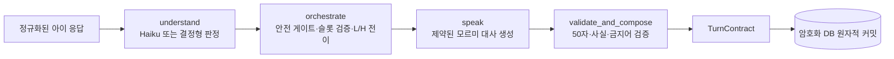

# 모르미 대화 API 아키텍처

## 1. 책임 경계

이 API는 화면을 직접 그리지 않지만, **집 가르치기와 카페 세션의 교육적 진행**을
담당한다.

집 반복학습 문제 풀이와 보상은 Spring이 원장으로 관리한다. 반복이 끝나면 Spring은
`curriculum_session_id`가 포함된 결과를 AI에 저장하고 `home_teach` 대화를 연다.
AI는 현재 검수된 36개 커리큘럼 카탈로그에서 해당 내용을 찾아 결정형 시나리오
스냅샷을 만든다. LLM은 학습목표·정답·힌트·별노트 문장을 새로 만들지 않는다.

현재 카페 프로토타입은 줄 서기·예산 메뉴 선택·메뉴값 계산·거스름돈의 4개 독립
시나리오만 제공한다. 5단계 통합 실습은 향후 범위이며 현재 라우팅과 콘텐츠 목록에
포함하지 않는다.

단계가 독립 대화이므로 각 화면은 해당 대화에 필요한 메뉴판과 모르미 메뉴를
`cafe_context`로 넘긴다. 현재 FE의 거스름돈 단계는 앞 단계 주문을 이어받지 않고,
모르미가 고른 메뉴 하나에 10,000원을 내는 독립 문제다.

Mormi-AI가 결정하는 것:

- 집 커리큘럼 ID에 대응하는 가르치기 과제 스냅샷
- 현재 스테이지와 하위 과제
- 현재 발화사다리 L, 힌트사다리 H, 하위 목표
- 응답 판정과 검증된 사실 슬롯
- 다음 질문, 입력 방식, 도움 카드, 시각 자료 종류
- 과제 완료와 다음 과제 진입
- 별노트 문장과 귀속
- 학습자별 다음 시작 L과 최근 H 사용 근거

Spring 백엔드가 담당하는 것:

- 사용자 인증과 학습자 식별
- 반복학습 결과와 장기 학습 기록의 최종 원장
- Mormi-AI 서비스 키 보관과 서버 간 호출
- AI 대화 결과의 별노트·프로필 변경값을 서비스 데이터에 반영
- 프론트엔드에 `TurnContract` 전달
- 카페 방문 진행도 원장(어느 단계까지 왔는지)
- 집 반복 시도 저장, `PracticeResult` 생성과 AI 대화 프록시

줄 서기·메뉴 선택·메뉴값 계산·거스름돈의 정오 판정은 이 서비스가 소유한다. 백엔드는 그
단계들을 다시 채점하지 않고 결과만 기록한다. 같은 문제를 두 곳이 채점하면
서로 다른 답을 낼 수 있다.

프론트엔드가 담당하는 것:

- 배경, 모르미 캐릭터, 말풍선, 도움 카드 렌더링
- 선택지, 수 세기, 세로식 등 조작 UI
- 음성 인식이 추가될 경우 STT 실행과 ASR confidence 전달
- TurnContract가 지정한 입력 외의 정답 판정은 하지 않음

```text
프론트엔드 → Spring Boot → FastAPI Mormi-AI
                         ← TurnContract
             ← 인증·서비스 데이터와 결합한 응답
```

## 2. 집 반복학습에서 가르치기로 전환

```text
FE 반복 문제 5회
  → Spring이 시도별 결과 저장
  → POST /v1/practice-results
       curriculum_session_id + 집계 결과
  → POST /v1/conversations
       scene=home_teach, scenario_id=home_teach, practice_result_id
  → AI가 검수 카탈로그에서 시나리오 생성·DB 고정
  → 이후 모든 질문/응답을 conversation_id 아래 저장
```

AI DB에는 생성된 시나리오 스냅샷, 턴 계약, 구조화 판정, 별노트가 항상 저장된다.
아이의 원문 발화는 보호자 동의가 있는 경우에만 암호화하여 30일 또는 90일 저장한다.
동의가 없으면 원문 대신 선택·슬롯·안전 분류 등 구조화 결과만 저장한다.

## 3. LangGraph 턴 워크플로



LangGraph에는 per-turn 임시 상태만 흐른다. 아이 원문을 LangGraph 체크포인터에 다시 저장하지 않는다. 영속 세션 상태와 원문 기록은 암호화 애플리케이션 DB가 단일 기준이다.

줄 인원은 세션 생성 시 한 번 정한다. 메뉴판·가격·이미지 경로·모르미 메뉴·예산은
프론트가 `SessionCreate.cafe_context`로 보낸다. AI 서버는 실제 메뉴 카탈로그를
소유하지 않고 전달받은 스냅샷을 `SessionState.scenario_data`에 고정한다. 따라서
새로고침, 서버 복구와 같은 `response_id` 재전송에서도 문제가 바뀌지 않는다.

운영 환경에서는 브라우저가 FastAPI를 직접 호출하지 않는다. 프론트가 BFF 또는
Spring 백엔드를 거쳐 메뉴 스냅샷을 전달하며, 서비스 간 키로 호출을 보호한다.
Spring에 정식 메뉴 카탈로그가 생기면 전달 가격을 그 카탈로그와 대조하는 것이
권장된다.

예산 메뉴 고르기의 합계는 전달받은 가격으로 결정형 코드가 계산해 화면에 보여준다.
예산을 넘으면 아이를 오답으로 평가하지 않고 시스템의 예산 상태를 보여준 뒤 같은
메뉴 선택 과제를 유지한다.

## 4. 발화사다리와 힌트사다리

설계 원본의 L4~L0, H0~H3을 별도 상태값으로 유지한다.

- 표현 막힘: `L↓`, `H 유지`
- 개념 오답/막힘: `L 유지`, `H↑`
- 부분 성공: 검증된 슬롯을 유지하고 빠진 슬롯 하나 요청
- 입력 인식 오류: L/H 모두 유지
- H2에서도 관계 연결 실패: H2를 유지하며 L1로 단계 분해
- L1-H2에서도 실패: L0-H3 공동 수행

집 반복학습의 정답률과 가르치기 표현 수준은 분리한다. 반복에서 틀린 문제는
개념 수행 근거로 저장하되, 집 가르치기의 첫 턴은 항상 `L4-H0`으로 열어 아이가
자기 말로 가르칠 기회를 먼저 보장한다. 발화사다리는 그 첫 반응을 관찰한 뒤에만
내려간다.

힌트는 자동 공개되는 `help_card`가 제공한다. 모르미 대사는 카드 내용을 자신의 지식처럼 말하지 않는다.

## 5. 자연스러운 전환

발화사다리 하강은 다음 구조를 사용한다.

1. 아이 반응을 실패로 규정하지 않음
2. 모르미가 질문 방식의 부담을 책임짐
3. 같은 문제와 숫자를 유지함
4. 더 작은 도움 하나만 요청함

예:

- L4→L3: “내가 한꺼번에 많이 물어봤네. 어느 줄인지 먼저 알려줘.”
- L3→L2: “말로만 들으려니 내가 헷갈려. 같이 골라볼까?”
- L2→L1: “어디부터 볼지 몰랐네. 사람 수부터 하나씩 볼까?”
- L1→L0: “도움 카드 순서대로 나와 같이 해볼까?”

## 6. 사실 슬롯과 원문

```text
암호화 원문 기록: 질문 + 아이 원문/선택
학습 상태: 검증된 슬롯만
화자 LLM: 검증 슬롯 + 빠진 슬롯 + 허용된 아이 표현만
별노트: 완결되고 사실인 직접 설명 또는 검수된 공동 문장
```

안전하고 모든 사실이 맞는 발화는 한 턴 동안 `quote_safe`, 안전하지만 오답이 섞인 발화는 수량을 가린 `context_only`, 위험·개인정보·해킹 발화는 `none`으로 화자에게 전달한다.

## 7. 실패 정책

- 분류기 실패: 상태를 바꾸지 않고 503 반환
- 화자 실패: 결정된 교육 진행은 유지하고 검수된 fallback 대사 사용
- 출력 검증 실패: 검수된 fallback 대사 사용
- 동일 `response_id` 재전송: 상태를 중복 진행하지 않고 최초 생성된 결과 턴 반환
- 오래된 `turn_id`: 409 반환
- 부분 오답: 맞은 슬롯만 저장하고 틀린 슬롯은 저장하지 않음

## 8. 저장

주요 테이블:

- `conversations`: 구조화된 최신 교육 상태
- `turns`: 암호화 질문·원문 응답과 구조화 판정
- `learner_profiles`: 기술별 안정 L, H0 성공, 최근 최대 H
- `practice_results`: 집 반복 결과
- `notes`: 별노트 문장과 직접/공동 귀속

운영에서는 PostgreSQL, 원문 암호화 키, 서비스 API 키를 강제한다.

파일럿 참여자는 사전 동의를 완료한 것으로 전제해 기본값을
`conversation_storage_consent=true`, `retention_policy=permanent`로 둔다. 질문과 아이
원문·선택 응답은 암호화해 만료 없이 저장하고, 턴 계약 JSON에는 평문을 중복 저장하지
않는다. 영구 정책에서는 `response_id`의 멱등 결과도 만료시키지 않는다.
